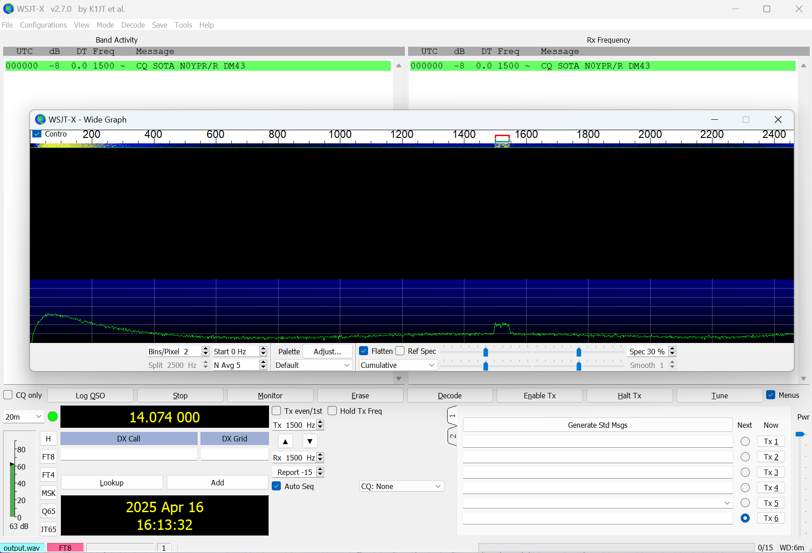
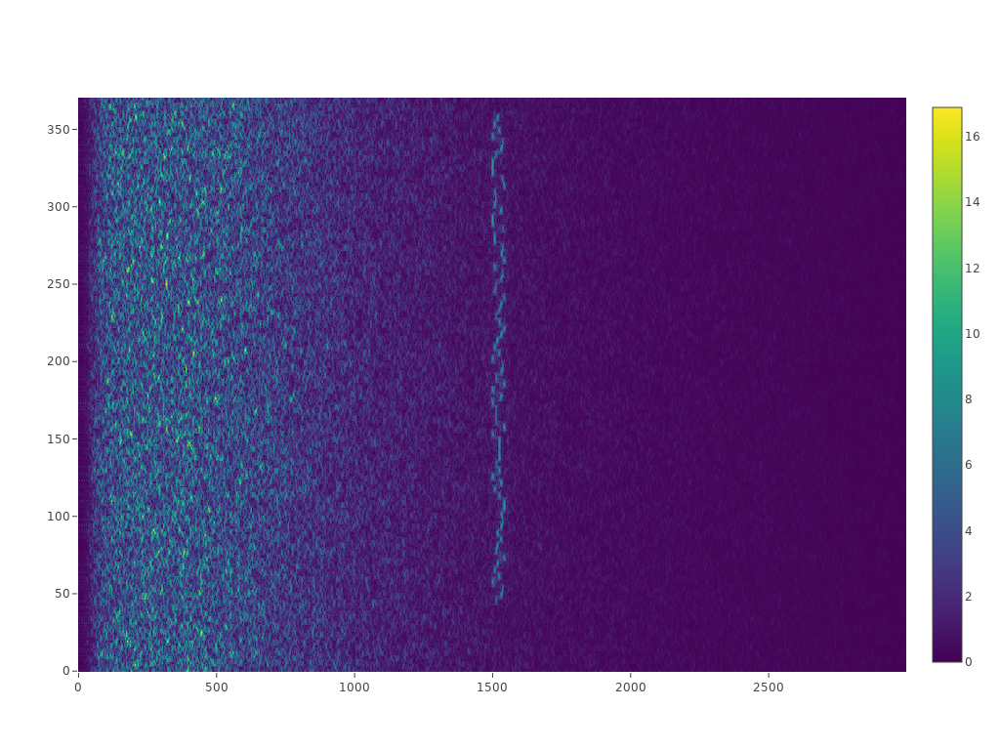

# RustyFt8
An implementation of FT8 using Rust.

This project strives to eventually be a complete implementation of the FT8 protocol. Unlike the official WSJT-X project, however, this project will never implement a UI itself. The intent is to expose a library that can be used by any number of UI implementations. One planned example would be a web based UI that can be run on a Raspberry PI or similar embedded compute device whose UI can be accessed via a tablet or phone. 

The short term goal of this project, however, is simply being able to encode an FT8 transmission into a wav file, then decode said wav file.

# Running the code

To encode a 'typical' FT8 transmission, with white noise added, into a wav file, and then (TODO) decode it:

```cargo run "CQ SOTA N0YPR/R DM43"```

This will encode the transmission, add in some gaussian noise, and write it out as a [wav file in plots folder](./plots/output.wav).

This wav file should be decodable by the WSJT-X application as seen here:


This will also eventually decode the the transmission.
 

# Acknowledgements
The following were used as inspiration and reference material for this project:
- [FT8 QEX article](https://wsjt.sourceforge.io/FT4_FT8_QEX.pdf) The official 'documentation' of the FT8 protocol originally published in QEX.
- [WSJT-X Source](https://sourceforge.net/p/wsjt/wsjtx/ci/master/tree/) WSJT-X Sourcecode, a mixture of Fortran and C++.
- [ft8-notes](https://github.com/vk3jpk/ft8-notes) A great explanation on how FT8 works written by VK3JPK. Easier to understand than reading the original Fortran code.

# Development Environment Setup with VS Code Dev Containers

This project uses a **Dev Container** to provide a consistent development environment. You can get up and running quickly with Visual Studio Code and Docker.

## Prerequisites

Before you begin, ensure the following are installed:

- [Visual Studio Code](https://code.visualstudio.com/)
- [Docker Desktop](https://www.docker.com/products/docker-desktop)
- [Remote - Containers extension for VS Code](https://marketplace.visualstudio.com/items?itemName=ms-vscode-remote.remote-containers)

If you're on **Windows**, also install:

- [Windows Subsystem for Linux (WSL2)](https://learn.microsoft.com/en-us/windows/wsl/install)
- A WSL2-compatible Linux distribution (e.g., Ubuntu)

---

## Cloning the Repository (Especially Important for Windows Users)

> 💡 **If you're on Windows**, it's *strongly recommended* to clone the repository into your **WSL filesystem** (`/home/<your-user>`), not into your Windows file system (`C:\Users\...`). This ensures full Linux filesystem compatibility and prevents potential issues with symlinks, file permissions, and performance.


